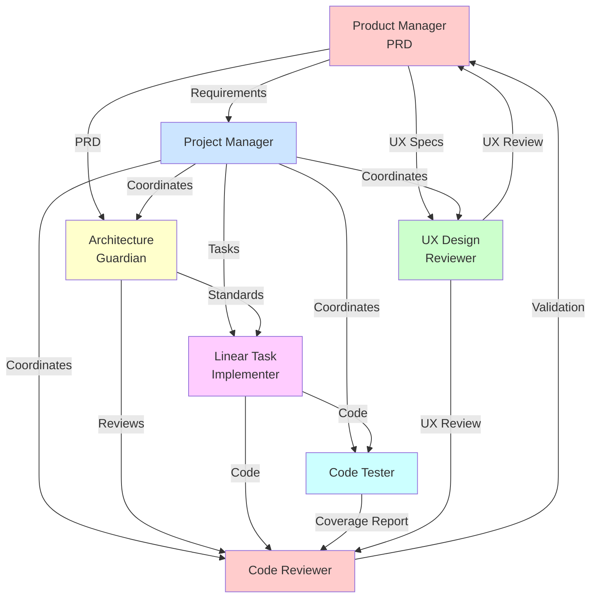
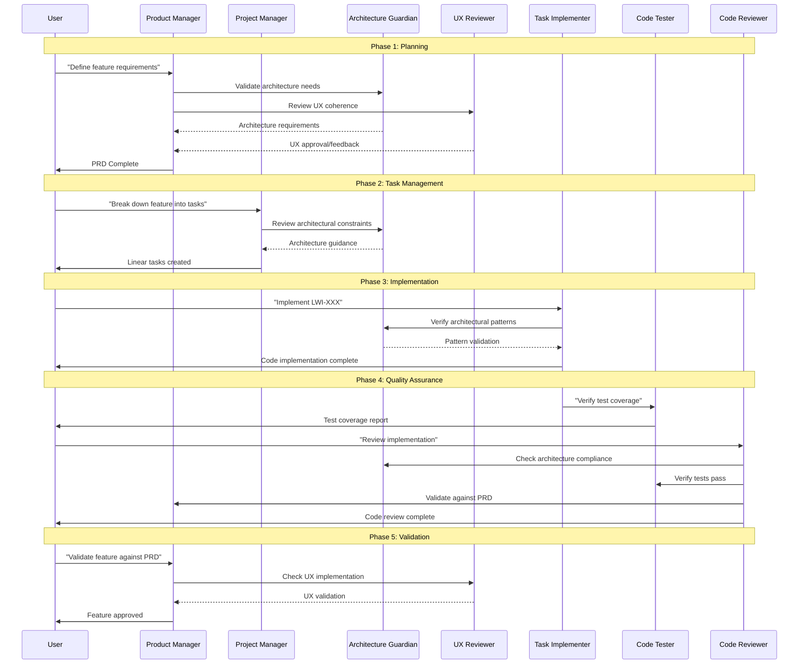
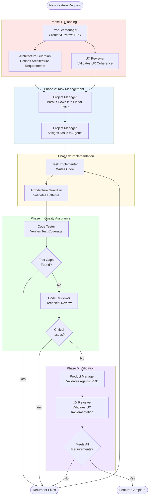

# Multi-Agent Workflow Documentation

This document describes the interaction patterns, sequences, and lifecycle of the 7-agent development system. It shows how agents coordinate with each other to deliver features from conception through implementation and quality assurance.

## Table of Contents

- [Overview](#overview)
- [Agent Interaction Diagram](#agent-interaction-diagram)
- [Feature Development Lifecycle](#feature-development-lifecycle)
- [Quality Gates](#quality-gates)
- [Workflow Patterns](#workflow-patterns)
- [Agent Coordination Protocols](#agent-coordination-protocols)
- [Execution Modes](#execution-modes)

## Overview

The multi-agent system operates on a **pipeline architecture** where each agent represents a stage or quality gate in the software development process. Agents can work:

- **Sequentially:** One agent completes, then hands off to the next
- **Parallelly:** Multiple agents execute simultaneously on different aspects
- **Conditionally:** Agents invoke others based on workflow state

## Agent Interaction Diagram

### High-Level Agent Relationships



### Agent Invocation Flow



## Feature Development Lifecycle

### Complete Feature Flow



### Phase Descriptions

#### Phase 1: Planning
**Objective:** Define clear, complete requirements with architectural and UX considerations

**Participants:**
- Product Manager: Creates/validates PRD
- Architecture Guardian: Reviews architectural implications
- UX Reviewer: Ensures UX coherence

**Outputs:**
- Completed PRD with acceptance criteria
- Architectural requirements documented
- UX flows validated

**Quality Gate:** All three reviewers approve before proceeding

---

#### Phase 2: Task Management
**Objective:** Break down feature into actionable Linear tasks

**Participants:**
- Project Manager: Orchestrates task creation

**Outputs:**
- Linear issues created with clear descriptions
- Branch naming conventions established
- Task dependencies identified
- Work assigned to implementer

**Quality Gate:** Tasks have clear acceptance criteria and test requirements

---

#### Phase 3: Implementation
**Objective:** Write production-ready code following standards

**Participants:**
- Linear Task Implementer: Writes code
- Architecture Guardian: Validates architectural patterns

**Outputs:**
- Feature implementation in feature branch
- Unit and integration tests
- Code formatted per project standards

**Quality Gate:** Code compiles and follows architectural patterns

---

#### Phase 4: Quality Assurance
**Objective:** Verify technical correctness and test coverage

**Participants:**
- Code Tester: Analyzes test coverage
- Code Reviewer: Performs technical review

**Outputs:**
- Test coverage report
- Code review findings
- List of issues (critical, major, minor)

**Quality Gate:** No critical issues, adequate test coverage

---

#### Phase 5: Validation
**Objective:** Confirm feature meets product requirements

**Participants:**
- Product Manager: Validates against PRD
- UX Reviewer: Validates user experience

**Outputs:**
- PRD validation report
- UX assessment
- Final approval or feedback

**Quality Gate:** Feature meets all requirements and provides good UX

## Quality Gates

Quality gates are checkpoints where work must meet specific criteria before proceeding. Each gate is enforced by one or more agents.

### Gate 1: Requirements Approval
**Stage:** After Planning Phase
**Enforced By:** Product Manager, Architecture Guardian, UX Reviewer

**Criteria:**
- PRD has clear acceptance criteria
- Architectural patterns are defined
- UX flows are coherent and complete
- No conflicting requirements

**Failure Action:** Return to PRD refinement

---

### Gate 2: Task Definition Quality
**Stage:** After Task Management Phase
**Enforced By:** Project Manager

**Criteria:**
- Each task has clear description and acceptance criteria
- Branch naming follows convention (username/ISSUE-ID-description)
- Test coverage requirements are explicit
- Dependencies are identified

**Failure Action:** Refine task descriptions

---

### Gate 3: Implementation Standards
**Stage:** During Implementation Phase
**Enforced By:** Architecture Guardian

**Criteria:**
- Code follows documented architectural patterns
- Proper separation of concerns
- Dependencies managed correctly
- Error handling implemented

**Failure Action:** Refactor to meet standards

---

### Gate 4: Test Coverage
**Stage:** After Implementation Phase
**Enforced By:** Code Tester

**Criteria:**
- Unit tests for all new functions
- Integration tests for component interactions
- Edge cases tested
- Test suite passes

**Failure Action:** Add missing tests

---

### Gate 5: Technical Review
**Stage:** After Test Coverage Gate
**Enforced By:** Code Reviewer

**Criteria:**
- No critical bugs or security issues
- Code quality meets standards
- PRD requirements implemented correctly
- No major technical debt introduced

**Failure Action:** Fix identified issues

---

### Gate 6: Product Validation
**Stage:** After Technical Review Gate
**Enforced By:** Product Manager, UX Reviewer

**Criteria:**
- All PRD requirements met
- User flows work as specified
- UX is intuitive and accessible
- No gaps in functionality

**Failure Action:** Address gaps or UX issues

## Workflow Patterns

### Pattern 1: Standard Feature Development

**Sequence:** Linear, with validation loops

```
Planning → Task Management → Implementation → QA → Validation → Complete
   ↓                                           ↓       ↓
   └──── Feedback Loop ────────────────────────┴───────┘
```

**When to Use:** New features or significant functionality

**Agents Involved:** All 7 agents in sequence

---

### Pattern 2: Quick Bug Fix

**Sequence:** Shortened path for small changes

```
Task Management → Implementation → Code Review → Complete
```

**When to Use:** Bug fixes that don't require new architecture

**Agents Involved:** Project Manager, Task Implementer, Code Reviewer

---

### Pattern 3: Architecture Review

**Sequence:** Focused on architectural concerns

```
Architecture Guardian → Code Reviewer → Complete
```

**When to Use:** Reviewing existing code for architectural compliance

**Agents Involved:** Architecture Guardian, Code Reviewer

---

### Pattern 4: PRD Refinement

**Sequence:** Collaborative planning refinement

```
Product Manager ←→ Architecture Guardian ←→ UX Reviewer
        ↓
    Complete PRD
```

**When to Use:** Before starting implementation on complex features

**Agents Involved:** Product Manager, Architecture Guardian, UX Reviewer (parallel)

---

### Pattern 5: Test Coverage Analysis

**Sequence:** Focused testing review

```
Code Tester → Task Implementer (if gaps) → Code Tester → Complete
```

**When to Use:** After implementation but before review

**Agents Involved:** Code Tester, Task Implementer (conditional)

## Agent Coordination Protocols

### Handoff Protocol

When one agent completes work and hands off to another:

1. **Status Documentation:** First agent documents completion status
2. **Context Transfer:** Relevant files, decisions, and constraints communicated
3. **Acceptance:** Second agent acknowledges receipt and validates context
4. **Execution:** Second agent begins work

### Example Handoff

```
Task Implementer → Code Tester

Handoff Package:
- Feature branch name: lwisne/LWI-123-user-auth
- Modified files: [list]
- New files: [list]
- Architectural patterns used: [description]
- Known edge cases: [list]
- Test framework: [name]
```

### Escalation Protocol

When an agent encounters issues beyond their scope:

1. **Issue Identification:** Agent identifies blocker or ambiguity
2. **Documentation:** Agent documents the specific issue
3. **Escalation:** Agent notifies Project Manager or user
4. **Resolution:** Issue is addressed before work continues

### Example Escalation

```
Code Reviewer → Project Manager

Issue: Critical security vulnerability found in authentication module
Severity: Critical
Impact: Cannot approve PR without fix
Recommendation: Return to Task Implementer for immediate remediation
```

## Execution Modes

### Sequential Execution

Agents execute one after another, each waiting for the previous to complete.

**Example:**
```
User: "Implement LWI-456, then verify test coverage, then perform code review"

Execution:
1. Task Implementer (writes code)
2. Code Tester (verifies tests)
3. Code Reviewer (performs review)
```

**Use Cases:**
- Standard development workflow
- When later agents need earlier agent outputs
- Quality gates that build on each other

---

### Parallel Execution

Multiple agents execute simultaneously on different aspects.

**Example:**
```
User: "Review the checkout feature for architecture, UX, and test coverage"

Execution (parallel):
- Architecture Guardian (reviews patterns)
- UX Reviewer (validates experience)
- Code Tester (analyzes coverage)
```

**Use Cases:**
- Independent review aspects
- Faster feedback cycles
- When agents don't depend on each other

---

### Conditional Execution

Agents are invoked based on conditions or findings from other agents.

**Example:**
```
Code Reviewer: "Found architectural issues"
→ Triggers Architecture Guardian for deeper analysis

Code Tester: "Test coverage below threshold"
→ Triggers Task Implementer to add tests
```

**Use Cases:**
- Quality gate failures
- Issue remediation workflows
- Adaptive quality assurance

---

### Iterative Execution

Agents cycle through review-fix-review loops until quality gates pass.

**Example:**
```
Iteration 1:
Code Tester → finds gaps → Task Implementer → adds tests

Iteration 2:
Code Tester → finds more gaps → Task Implementer → adds tests

Iteration 3:
Code Tester → all coverage met → proceed to Code Reviewer
```

**Use Cases:**
- Ensuring complete test coverage
- Resolving complex issues
- Meeting strict quality standards

## Best Practices

### Invoking Agents

1. **Be Explicit About Phase:** "I'm ready for code review" is clearer than "review this"
2. **Provide Context:** Reference Linear issue IDs, file paths, or PRD sections
3. **Specify Scope:** "Review authentication module" vs "review entire codebase"
4. **Allow Agent Chains:** Let agents invoke each other when appropriate

### Agent Communication

1. **Document Decisions:** Each agent should document why decisions were made
2. **Reference Standards:** Cite specific sections of architecture or testing docs
3. **Be Specific:** "Violates separation of concerns in UserService" not "bad code"
4. **Suggest Solutions:** Don't just identify problems, propose fixes

### Quality Management

1. **Don't Skip Gates:** Each gate exists for a reason
2. **Iterate When Needed:** It's better to fix issues early than late
3. **Update Standards:** When patterns emerge, add them to architecture docs
4. **Track Metrics:** Monitor how often gates fail to improve processes

## Customizing Workflows

### Adding New Agents

To add a specialized agent to the workflow:

1. Create agent file in `.claude/agents/`
2. Define clear responsibilities and scope
3. Add invocation examples in description
4. Update this workflow documentation
5. Define handoff protocols with existing agents

### Modifying Agent Sequences

To change the standard workflow:

1. Edit agent descriptions to reflect new handoff points
2. Update quality gate criteria
3. Document the new sequence in this file
4. Test the workflow end-to-end

### Removing Quality Gates

Only remove gates if:

1. Your project doesn't need that level of rigor
2. You have alternative quality mechanisms
3. You document why the gate was removed
4. You update agent coordination protocols

## Troubleshooting

### Issue: Agents Not Invoking Each Other

**Symptoms:** User has to manually invoke each agent

**Solutions:**
- Ensure agent descriptions include clear invocation triggers
- Add explicit handoff statements in agent prompts
- Reference downstream agents in upstream agent instructions

### Issue: Quality Gates Being Skipped

**Symptoms:** Code merged without proper review stages

**Solutions:**
- Make gate criteria explicit in agent prompts
- Add blocking statements in agent outputs
- Update Project Manager to enforce gate sequence

### Issue: Redundant Agent Work

**Symptoms:** Multiple agents checking the same things

**Solutions:**
- Clarify agent responsibilities to reduce overlap
- Define clear boundaries between agent scopes
- Update handoff protocols to avoid duplicate work

### Issue: Bottlenecks in Workflow

**Symptoms:** One agent becomes a bottleneck slowing everything

**Solutions:**
- Identify if agent scope is too broad
- Consider splitting agent into specialized sub-agents
- Enable parallel execution where possible

## Metrics and Monitoring

Track these metrics to optimize your workflow:

- **Time per Phase:** How long each phase takes on average
- **Quality Gate Failures:** Which gates fail most often and why
- **Iteration Count:** How many fix cycles before completion
- **Agent Invocation Patterns:** Which workflows are most common
- **Defect Escape Rate:** Issues found after validation phase

## Conclusion

This multi-agent workflow provides a structured, quality-focused approach to software development. By understanding the interaction patterns, quality gates, and coordination protocols, you can effectively orchestrate complex development work with consistent quality outcomes.

The workflow is designed to be flexible - adapt it to your team's needs while maintaining the core principle: **quality built in at every stage, not just checked at the end**.
